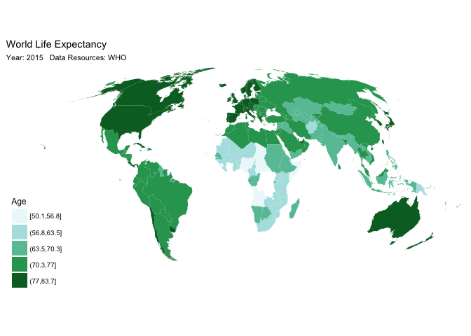

Assignment 1
================
Shuai Shao
4/9/2018

Part 1. Visualization Critique
------------------------------

In this assignment, I will analyze the [“money and happiness”](http://www.visualcapitalist.com/wp-content/uploads/2018/03/money-happiness-large.html) graph from Visual Capitalist. This is an attracting graph that depicts the relationship between money (GDP) and self-reported happiness. I will analyze five core dimensions in detail, namely **Truthful**, **Functional**, **Beautiful**, **Insightful**, and **Enlightening**.

**Truthful**

The GDP data come from the [World Bank](http://www.worldbank.org/). The self-reported happiness data come from [Gallup](http://www.gallup.com/home.aspx). Gallup is a research-based, global performance-management consulting company, known for its public opinion polls conducted worldwide. The World Bank is an international financial institution, with a goal of promoting international trade and to the facilitating capital investment. In general, both Gallup and the World Bank are reliable data sources for data analysts. And the author calculated the data from 125 countries or regions, which is large enough to depict a general relationship across the world.

There are several apparent shortcomings in this graph:

First, the title is not appropriate. Although the word “money” is easy to understand, it is not professional. Also, “money” has different meanings in different people. Does it refer to “annual household income,” “all the property you have,” or “the number on your bank account”? It is more suitable to use the word “GDP” directly. Second, GDP is a parameter to evaluate a country or region’s economic performance. It would be better if we could establish the relationship between individual annual income and self-reported happiness directly.

Second, the graph failed to report in which year the data were collected. In the modern society, the world changes dramatically, and the situation in 2017 could be entirely different from that in 2007. Therefore, it is less truthful and meaningful it the author failed to provide the year of the data.

Third, the author should briefly introduce how the self-reported happiness works. Is it an 8-point Likert-Scale or a 9-point Likert-Scale? How large is the sample size in each country (region) and how representative are the samples? These factors are all critical to the truthfulness of data visualization.

Forth, the author justified some outliers such as Luxembourg and Qatar while ignoring some other outliers such as Burundi, Singapore, Kuwait, etc. We can understand that the author wanted to tell us that several countries (regions) deviated from the trend line. But it is not clear how the author selected the circles to justify, and it seems that the author chose those data on purpose.

Fifth, the majority of circles are crowded at the top of this graph, while some outliers are far away from them. This coordinate could potentially conceal the real relationship between two variables. It would be better if the author could adjust the range of axes and take out some extreme value such as Luxembourg and Qatar, and zoom in the top corner.

**Functional**

The graph could help the reader understand the information properly. A coordinate is the best way to depict the relationship between two variables. Readers can easily understand the general information that the author wants to express in this graph. Specifically, the author used different methods to convey different information: The size of circle denotes the population of that country (region). The color denotes the continent where the country (region) is located. Particularly, the author highlighted some outlier and justified the outlines in a brief sentence, which makes the information more meaningful. It would be better if the author could transfer the static graph into an interactive one. An interactive group allows readers to explore different aspects based on their own interests. For instance, the author can design an interactive graph in which readers can explore the information by continent, by undeveloped/developing/developed countries (regions), etc.

**Beautiful**

Generally speaking, it is a beautiful and well-designed graph with fruitful information for readers. The colors that the author chose are beautiful and attractive. I am particularly in favor of his way to present the population size and the country code.

However, the most confusing part is that the author didn’t construct a traditional Cartesian coordinate. Instead, the axes are oblique. I understand that the author would like to present a horizontal trend line to differentiate “more satisfied with what they have” and “less satisfied with what they have,” but a rotated coordinate is contrary to our human being’s common sense. Second, the author should follow the principle of simplicity and simplify the graph. The topic of this graph is overcrowded with a large number of labels and circles. The author label some circles with their country (region) name but not others. And it seems a little messy. Third, I suggest that author should change the color for Africa. Grey is usually regarded as invalid or unimportant in the graph. Readers can easily miss those grey circles. It would be better if the author can use a more transparent color such as orange or pink.

**Insightful**

Particularly, this graph involves both spontaneous insight and knowledge-building insights. First, at the first glimpse of this graph, readers can easily see a linear and positive correlation between money (GDP) and happiness. When looking through the graph, readers will surely notice the outliers that the author highlighted, and they learn that not all the countries or regions followed the linear model as the author predicted, which is a knowledge-building process.

It would be better if the author could tag whether the country (region) is a developing country (region) or developed country (region). As the author explained in the text, “the resulting correlation is quite clear, especially early on in a country’s development. Therefore, if readers can know whether this country is an undeveloped/developing/developed country directly, the graph would be more insightful.

**Enlightening**

The linkage between material well-being and psychological wellness is almost a new topic for social scientists. But this topic matters because it is tightly related to people’s well-being. Improving a country’s GDP (economic level) is as important as enhancing a country’s happiness since happiness is one of the critical indicators to evaluate the life quality. Therefore, recently, a large number of social scientists are devoted to understanding this relationship. First, scientists should resolve the problem that in people in some wealthy countries or regions (such as Hong Kong) are not as happy as we predicted. Second, scientists are encouraged to study why people some undeveloped countries (such as Algeria) are happier than our expectation and improve the happiness in other undeveloped countries. Generally speaking, social scientists nowadays are more and more interested in psychological well-being including happiness and they are struggling for promoting human’s happiness.

Part 2. `ggplot2` and the graphics
----------------------------------

In this assignment, I draw a picture to depict the life expectancy of each country. In MACS30500 (Computing for Social Science), we learned how to draw a map with `ggplot2`. In that assignment, I made a life expectancy map with `gapminder` package. However, the most recent data in `gapminder` is 2007 and the world has changed a lot since then. In this way, `gapminder` package could potentially attenuate the truthfulness and reliability if I would like to draw a life expectancy map. In this assignment, I will use the most updated dataset on Wikipedia, which was renewed in 2016. The original dataset on Wikipedia came from [World Health Organization (WHO)](http://www.who.int/en/), a specialized agency of the United Nations that is concerned with international public health. Therefore, the data source is reliable and truthful.

I chose this topic because it is enlightening. International public policymakers are concerned about the inequity among countries. Life expectancy is one of the critical indicators to understand the inequity of human life around the world. It is widely acknowledged that the developed countries have higher life expectancy compared to developing or underdeveloped countries. Previously, the majority of scientists mainly focused on the relationship between GDP and life expectancy. In this part, I chose to express my story and display my data with a world map because a map is the best way to present the data in different countries and it will tell us more interesting stories than traditional Cartesian coordinate.

My graphic is consist of following elements:

1.  Title: I explicitly explain what I did in the tile
2.  Subtitle: in the subtitle, I introduced the data source and in which year the data were collected
3.  Legend: the color indicates in which range the country’s life expectancy is located. I quinquesected the life expectancy, ranging from 50.1 (Sierra Leone) to 83.7 (Japan). Five sections are best for this graphic because more sections will be confusing and indistinguishable while fewer sections could hardly convey adequate information.
4.  Fill: I chose `BuGn` because it is distinguishable for readers and green denotes “life” and “vigor.” The life expectancy is higher if the color in that country is darker.

There are several ways to read this graphic:

First, by continent, it is easy to see that **North America**, **Europe** and **Oceania** have the highest life expectancy around the world, **South America** and **Asia** also have a high life expectancy, while **Africa** has the lowest life expectancy. This result is consistent with our intuition: Economically, the wealthier (more developed/industrialized) countries (such as Canada, the United States, and countries in Europe) are likely to have higher expectancy. The wealthiest countries in the world are aggregated in **North America**, **Europe**,and **Oceania**. These countries have more financial resources and sounder health system. Therefore, the life expectancy is higher than other countries.

Second, Geographically, the closer to the equator, the lower life expectancy this country will be. The hot weather (higher average temperature in a year) could potentially attenuate the life expectancy. For instance, residence in the tropic are more likely to be affected by infections than their peers in cold zone. It is physical environment rather than the economic level that have a significant impact on the life expectancy, which is an original hypothesis that contrary to the traditional economic view.

The original dataset from Wikipedia contains “country”, “both sexes rank”, “both sexes life expectancy”, “female rank”, “female life expectancy”, “male rank”, “male life expectancy”, “both sexes rank (HALE)”, and “both sexes life expectancy (HALE)”. Health-adjusted life expectancy (HALE) is a professional indicator in the health study. If we could only draw a single picture to display the data, “both sexes life expectancy” is the most representative one. Therefore, when cleaning the data, I just kept the “country” and “both sexes life expectancy.”

In sum, the whole procedure involves the following decision-making process:

1.  What: What data will I present? An enlightening topic and proper data source is the first step to make a perfect graphic. The life expectancy is an absorbing topic for laypeople, and it is also valuable to social scientists.
2.  Which: Which detailed information should I include in the graphic? Overloaded information disobeys the principle of simplicity while oversimplified information could potentially conceal the truthfulness. Therefore, in this single graphic, I chose the most representative variable in the dataset, namely "both sexes life expectancy" in the original dataset.
3.  How: How (in what form) should I present the data? I chose a world map to display the data because it is the best way to show the relationship between geography and life expectancy. Also, it is easy for readers to read the life expectancy data of major countries (such as the United States, Canada, China, Russia, etc.).
